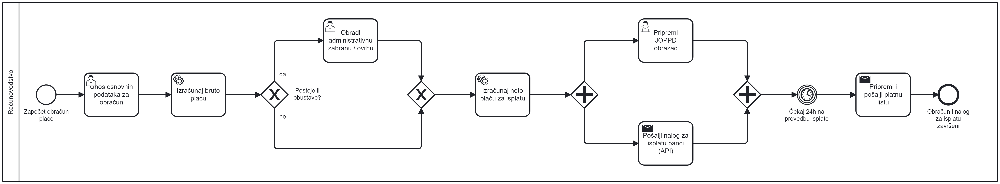

# ⚙️ Modeliranje poslovnog procesa obračuna i isplata plaća u Ministarstvu unutarnjih poslova Republike Hrvatske

Ovaj repozitorij sadr쬴 cjelokupnu projektnu dokumentaciju i tehničku implementaciju za projektni zadatak iz kolegija "Upravljanje poslovnim procesima", čija je tema **"Modeliranje poslovnog procesa obračuna i isplata plaća u Ministarstvu unutarnjih poslova Republike Hrvatske"**.

Projekt je strukturiran u dva glavna dijela:
1.  **📂 Opća projektna dokumentacija:** Originalni As-Is model procesa i popratni seminarski rad.
2.  **💻 Procesna aplikacija i servisi:** Implementirani, izvršni BPMN model, prateći API servisi i vizualni dijagram.

---

## 1. 📂 Opća projektna dokumentacija

Ovaj dio sadr쬴 temeljne dokumente projekta koji su slu쬴li za analizu.

-   **📎 [Seminarski rad (PDF)](./seminar-paper.pdf):** Cjelokupna analiza, opis modela, prijedlozi za poboljšanje i detalji implementacije.
-   **📎 [As-Is model procesa (BPMN)](./as-is-process-model.bpmn):** Sveobuhvatna BPMN izvorna datoteka za početni, detaljni As-Is model procesa.
-   **📈 Dijagram As-Is procesa:** Vizualni prikaz kompleksnog, početnog modela procesa.
    

---

## 2. 💻 Implementirana procesna aplikacija (`/process-app`)

Ovaj direktorij sadr쬴 sve datoteke vezane uz izvršnu, *model-driven* aplikaciju razvijenu u Camundi 7.

### 2.1. 📈 Izvršni BPMN model

Pojednostavljena, izvršna verzija procesa, fokusirana na aktivnosti unutar računovodstva.

-   **📎 [Izvršni proces (BPMN)](./process-app/executable-process-model.bpmn):** Izvorna datoteka koja je deployana na Camunda 7 engine.
-   **📈 Dijagram izvršnog procesa:**
    

### 2.2. 📡 Prateći API servisi

Aplikacija se integrira s dva neovisna Node.js/Express mikroservisa, koji se pozivaju iz procesa korištenjem **HTTP Connectora**.

#### 🏦 Bankarski API servis (`/process-app/camunda-api-servis`)

Ovaj servis simulira jednostavan REST API bankovnog sustava koji prima nalog za isplatu.

-   **Endpoint**: `POST http://localhost:3000/api/banka/nalog`
-   **Postavljanje i pokretanje**:
    1.  `cd process-app/camunda-api-servis`
    2.  `npm install express`
    3.  `node index.js`

#### 📧 Email servis (`/process-app/express-email-server`)

Ovaj servis djeluje kao posrednik prema EmailJS platformi za slanje automatiziranih e-mailova.

-   **Endpoint**: `POST http://localhost:3002/send-email`
-   **Konfiguracija**: Zahtijeva `.env` datoteku u svom korijenskom direktoriju (`/process-app/express-email-server`) s vašim EmailJS podacima (`SERVICE_ID`, `TEMPLATE_ID`, `PUBLIC_KEY`, `PRIVATE_KEY`).
-   **Postavljanje i pokretanje**:
    1.  `cd process-app/express-email-server`
    2.  `npm install express axios cors dotenv`
    3.  Kreirajte i konfigurirajte svoju `.env` datoteku.
    4.  `node index.js`

---
---

### **English Version**

# ⚙️ Modeling the Payroll Process in the Ministry of the Interior of the Republic of Croatia

This repository contains the complete project documentation and technical implementation for the "Business Process Management" course project, titled **"Modeling the Business Process of Payroll Calculation and Payout in the Ministry of the Interior of the Republic of Croatia"**.

The project is structured into two main parts:
1.  **📂 General Project Documentation:** The original As-Is process model and the accompanying seminar paper.
2.  **💻 Process Application & Services:** The implemented, executable BPMN model, its supporting API services, and a visual diagram.

---

## 1. 📂 General Project Documentation

This section contains the foundational documents of the project, used for the analysis phase.

-   **📎 [Seminar Paper (PDF)](./seminar-paper.pdf):** The complete analysis, process descriptions, improvement proposals, and implementation details (in Croatian).
-   **📎 [As-Is Process Model (BPMN)](./as-is-process-model.bpmn):** The comprehensive BPMN source file for the initial, detailed As-Is process model.
-   **📈 As-Is Process Diagram:** A visual representation of the complex, initial process model.
    

---

## 2. 💻 Implemented Process Application (`/process-app`)

This directory contains all the assets related to the executable, model-driven application developed in Camunda 7.

### 2.1. 📈 Executable BPMN Model

A simplified, executable version of the process, focusing on activities within the accounting department.

-   **📎 [Executable Process (BPMN)](./process-app/executable-process-model.bpmn):** The source file deployed to the Camunda 7 engine.
-   **📈 Executable Process Diagram:**
    

### 2.2. 📡 Supporting API Services

The application integrates with two independent Node.js/Express microservices, called from the process using the **HTTP Connector**.

#### 🏦 Bank API Service (`/process-app/camunda-api-servis`)

This service simulates a simple REST API for a banking system that receives payment orders.

-   **Endpoint**: `POST http://localhost:3000/api/banka/nalog`
-   **Setup**:
    1.  `cd process-app/camunda-api-servis`
    2.  `npm install express`
    3.  `node index.js`

#### 📧 Email Service (`/process-app/express-email-server`)

This service acts as a proxy to the EmailJS platform for sending automated emails.

-   **Endpoint**: `POST http://localhost:3002/send-email`
-   **Configuration**: Requires a `.env` file in its root directory (`/process-app/express-email-server`) with your EmailJS credentials (`SERVICE_ID`, `TEMPLATE_ID`, `PUBLIC_KEY`, `PRIVATE_KEY`).
-   **Setup**:
    1.  `cd process-app/express-email-server`
    2.  `npm install express axios cors dotenv`
    3.  Create and configure your `.env` file.
    4.  `node index.js`